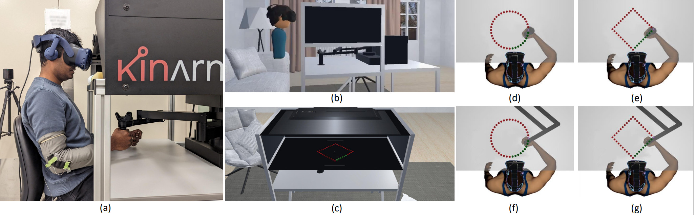

# Immersive virtual reality and robotics for upper extremity rehabilitation

Upper limb impairment significantly impacts daily activities and quality of life. Traditional robotic systems have been widely used in neurological rehabilitation applications. However, its adoption has been limited to laboratory and clinical settings due to cost constraints. Our study aimed to assess the feasibility and usability of a cost-effective virtual reality (VR) for home-based upper limb training. We used a customized wearable sleeve sensor to assess the hand and elbow joint movements.  

# Citation
Chheang, V., Lokesh, R., Chaudhari, A., Wang, Q., Baron, L., Kiafar, B., Doshi, S., Thostenson, E., Cashaback, J. and Barmaki, R.L., 2023. Immersive virtual reality and robotics for upper extremity rehabilitation. arXiv preprint arXiv:2304.11110. DOI: 
https://doi.org/10.48550/arXiv.2304.11110
